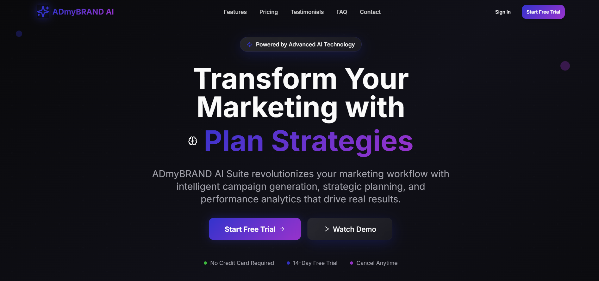
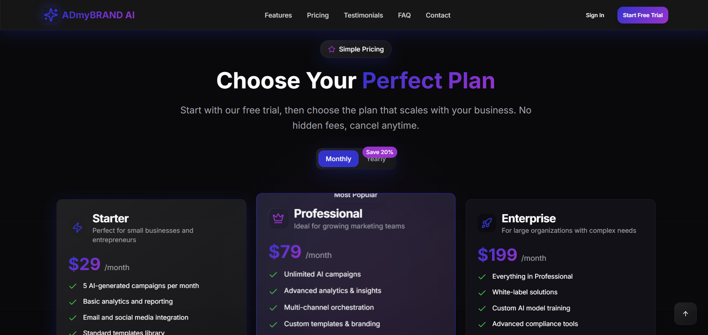
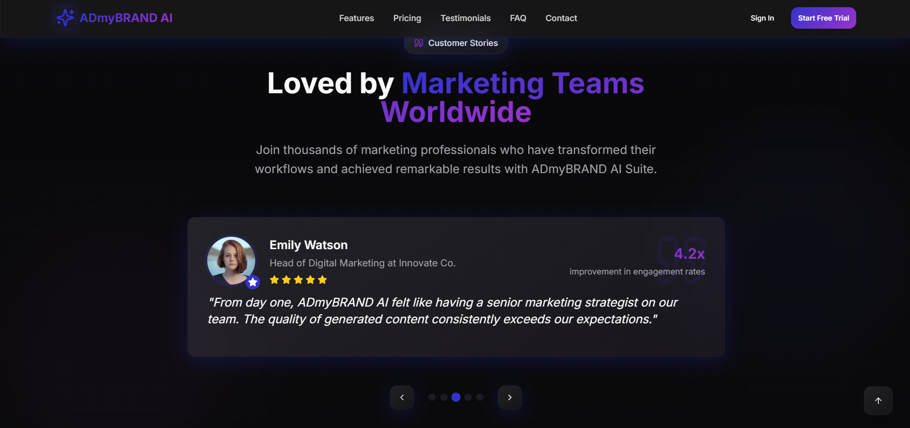

---

# 🚀 ADmyBRAND AI Suite – Modern SaaS Landing Page

An elegant, visually striking, and fully responsive SaaS landing page crafted for AI-based business platforms. Designed with cutting-edge UI/UX practices, fluid animations, and reusable component architecture to deliver a memorable first impression and high conversion potential.

## 🔍 Project Preview

### Preview 1


### Preview 2


### Preview 3


---

## 📖 Overview

The ADmyBRAND AI Landing Page is a high-fidelity modern SaaS marketing interface that blends aesthetics, performance, and accessibility. Developed with a **component-first approach**, the layout is tailored for AI product suites and scalable business tools. The interface reflects a confident brand voice with crisp typography, gradient highlights, and animated elements that keep the user engaged from scroll to click.

This landing experience is structured to serve as a **real-world SaaS homepage**, optimized for **branding, product showcasing, trust-building**, and **call-to-action conversions**—with flexibility for future integration with backend tools, dashboards, or onboarding flows.

---

## 🌟 Features


### ✨ Modern Hero Section with Animated Headlines

* A fully responsive, gradient-backed hero unit with large bold typography.
* Dynamic rotating text such as:
  *“Greater Peace in Your Heart → Greater Love in Your Relationships → Greater Purpose in Your Life Direction”*
* Smooth fade-in transitions and scroll-triggered animation effects powered by **Framer Motion**.

### 📱 Fully Responsive UI

* Tailored designs for mobile, tablet, and desktop.
* Adaptive grid layouts, mobile-first image scaling, and touch-optimized interactions.
* Sticky navigation and smart stacking to maintain UX integrity across devices.

### 🎯 Clear Call-to-Actions (CTAs)

* Strategically placed buttons with animated hover effects to guide user action.
* Section-linked anchors for smooth scrolling (e.g., Features, About, Contact).

### 🎨 Component-Based Design System

* Reusable **React + Tailwind CSS components** with consistent naming, spacing, and variants.
* Includes: `Hero`, `Header`, `Features`, `Testimonials`, `CTA Banner`, `Footer`.

### 💡 Feature Highlights Section

* Modular blocks to represent SaaS product features or tools.
* Accompanied by icons, short titles, and engaging microcopy.

### 🧠 Testimonials & Social Proof

* Testimonial cards with photos, role titles, and speech bubbles.
* Option to plug into CMS or backend API for real-time updates.

### 🌐 SEO & Accessibility Friendly

* Semantic HTML, optimized alt text, logical heading structure.
* WCAG-compliant color contrasts and keyboard navigation readiness.

### 🎥 Scroll-Based Animations

* Smooth scroll-triggered animations for section reveal and element entrance.
* Enhances visual delight while maintaining readability and clarity.

### 🪄 Polished UI Styling

* Elegant gradient backgrounds, subtle shadows, animated borders.
* Refined spacing, fluid layout responsiveness, and classy typography combinations using **modern SaaS visual language**.


---

## 🚀 Getting Started (Local Setup)

Follow these steps to set up the project locally:

### 1. Clone the Repository

```bash
git clone https://github.com/your-username/your-repo-name.git
cd your-repo-name
```

### 2. Install Dependencies

Using your preferred package manager:

```bash
# with npm
npm install

# or with yarn
yarn install
```

### 3. Set Up Environment Variables

Create a `.env.local` file in the root directory and configure the required environment variables.
Example:

```env
NEXT_PUBLIC_SUPABASE_URL=your_project_url
NEXT_PUBLIC_SUPABASE_ANON_KEY=your_anon_key
```

### 4. Run the Development Server

```bash
npm run dev
# or
yarn dev
```

Navigate to [http://localhost:3000](http://localhost:3000) to view the app.

---


## 🧩 UI Inspiration & Design References

* Inspired by clean SaaS platforms from [Dribbble](https://dribbble.com) and [Behance](https://behance.net)
* Layout and design decisions guided by:

  * **Vercel**, **Linear**, **Notion**, and **Superhuman** landing pages.
  * ShadCN UI patterns and Chakra UI layout principles.
  * Color palettes and gradients designed using [uigradients.com](https://uigradients.com)

---

## 🛠️ Tech Stack & Libraries

* **React 18** with **TypeScript**
* **Tailwind CSS** for utility-first styling
* **Framer Motion** for scroll and hover animations
* **Lucide Icons** for crisp, scalable SVG icons
* **ShadCN UI** components for accessibility & customization
* **Vite** for blazing-fast local development
* **Deployed on Vercel** for instant global performance

---

## 💻 Live Demo

🌐 Visit the live deployment:
**[LINK](https://a-dmy-brand-ai-suite.vercel.app/)**


---

## 🔍 Key Sections Breakdown

| Section          | Purpose                                                     |
| ---------------- | ----------------------------------------------------------- |
| `Header`         | Branding, sticky navbar, anchor links for smooth navigation |
| `Hero`           | First-glance impression with powerful messaging             |
| `Features`       | Modular highlights for AI product capabilities or benefits  |
| `Testimonials`   | Client stories, use cases, or endorsements                  |
| `Call-to-Action` | Final scroll anchor to encourage user signup or contact     |
| `Footer`         | Branding, links, contact info, social icons                 |

---

## 🤖 AI Usage Report

### AI Tools Used
- **Primary tools**:
  - ChatGPT (for architecture planning, code scaffolding, content writing)
  - GitHub Copilot (for autocomplete and utility code generation)
  - v0.dev (for generating responsive UI components)
  - Figma AI (for UI wireframing and visual layout ideas)

- **Key use cases**:
  - UI layout generation (hero section, cards, charts)
  - Tailwind + shadcn/ui component generation
  - Smooth scroll and animation implementation (Framer Motion)
  - Prompted reusable component architecture (Button, Card, Chart, Table)
  - Readme writing and task planning with AI support

---

### Sample Prompts Used

1. `"Create a responsive hero section using Next.js and Tailwind with glassmorphism style and CTA buttons"`
2. `"Generate a modern pricing card component with hover effects using shadcn/ui"`
3. `"How to implement parallax scroll and floating animation in a Next.js landing page?"`

---

### AI vs Manual Work Split

- **AI-generated (~60%)**:
  - Initial component scaffolding (Hero, Pricing, Features, Dashboard Widgets)
  - Boilerplate layout (Next.js App Router, layout.tsx, etc.)
  - Utility functions and styling help (Tailwind configs, animation logic)

- **Manual coding (~40%)**:
  - Custom logic for chart responsiveness, state management
  - Component composition and integration
  - Final layout polishing, media queries, accessibility improvements
  - Animation tuning and interactive UX refinement

- **Customization**:
  - Refined all AI-generated code to meet brand theme and interaction goals
  - Adjusted typography, spacing, responsiveness, and ARIA labels
  - Converted static suggestions into dynamic, reusable components

---

##### This report highlights how AI was used not only to speed up development but also to improve component quality and visual consistency.

---

## 🎯 Highlights & UX Strategy

* 👁 **Visual Hierarchy** – Titles, sections, and components spaced and sized for maximum scannability.
* 🎬 **Motion** – Controlled use of animation to guide attention, not distract.
* 🔍 **Conversion-Oriented Layout** – CTAs placed with funnel-awareness.
* 📱 **Mobile First** – Fully optimized for handheld experience.
* 📦 **Scalable Components** – Ready for reuse in other product pages or dashboard layouts.


---

## 📩 Contact

Created with ❤️ by **Mukund Thakur**

🔗 GitHub: [@Mukund934](https://github.com/Mukund934)
📧 Email: [mukund.th04@gmail.com](mailto:mukund.th04@gmail.com)

---


